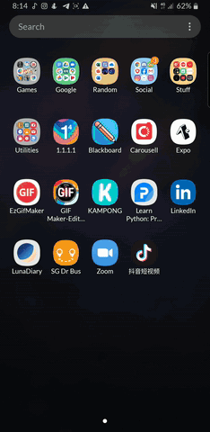

# KAMPONG 
#### Re-establishing Routines and Neighbourhood Support

*Done By: Han Xing Yi, Lee Yen Theng,
Patria Lim Yun Xuan, Kelly Yeoh Kaili*

For BrainHack CODE_EXP 2020

---

## Table of Contents
* [General Info](#general-info)
* [Technologies](#technologies)
* [How To Use and Limitations](#how-to-use-+-limitations)
* [TODO](#todo)

---

## General Info
**KAMPONG** was created for CODE_EXP 2020 under the problem statement to build resilience during/ after a health crisis. 

During this Circuit Breaker period, the people that we are stuck with the most (other than our family, of course) are our neighbours! Yet, how many times did we communicate with our neighbours throughout this tough period? Not many?

Presenting to you KAMPONG!
The app that re-establishes routine and neighbourhood support in times of crisis

Our aim for KAMPONG is to bring the community together through:
1. Engaging in Communal Projects that can be proposed by the people around you! This can range from running 100km collectively in June, to reading 100 books per person for 2020. 
2. Setting Community Goals to promote ownership of community space and a greater sense of community, and also to get you back on track after a long Circuit Breaker.
3. Plan Community Events such as karaoke or movie sessions that fosters stronger bonds within the community through interaction and inclusivity, and hence building a more resilient community.

---

## Technologies

This app was built with love with React Native Expo SDK 37.0.1 and Google Firebase 7.14.6 with React Native, made entirely with Expo's snacks. 

#### Files Overview

<pre>
KAMPONG
├── components
|   ├── Form
|   |   ├── FormButton.js
|   |   └── FormInput.js
|   ├── BuildPage.js
|   ├── ExplorePage.js
|   ├── Form.js
|   ├── Login.js
|   ├── ProjDescrp.js
|   ├── ProjSuccess.js
|   ├── male-profile-image.png
|   └── sunset.jpg
├── assets
│   ├── kampong.png
│   └── splash.png
├── App.js
├── BuildStack.js
├── ChatStack.js
├── ExploreStack.js
├── Fire.js
├── TabView.js
├── app.json
├── package.json
├── node_modules
└── yarn.lock
</pre>

---

## How To Use + Limitations

1. Log in with your name. *(Ideally, it would be saved to Firebase so that you can access a specialised profile)*
2. The first page you see is the Build Page. This page should indicate all the projects that you have joined with the progress indicated by a togglable progress bar. *(We hardcoded the project details.)*
3. Click on the `+` button in the bottom right hand corner. This brings you to a form to **Create a New Project**.
4. Enter your Project Details, then click `Submit Form`. This will create a new card on the `Explore` tab. Check it out! *(One backend we worked hard on!)*
5. The Explore tab contains community projects proposed by other users and you! 
6. Clicking `Join Now` will bring you to a more in-depth description of the project. Clicking `Join` will then add you to the project. *(This should all be linked, but we hardcoded the Project Description page due to time constraints.)*
7. After joining, interact with your group members in the `Chat` tab! *(Usernames should be displayed, but we enabled Anonymous Sign-in for purposes of this hackathon. Also, there should be multiple groups instead of just one main chat. But then again, time constraints.)*

---

## TODO

- [ ] Add a Profile Page for users to edit their credentials and manage app settings 
- [ ] Work on backend code to sync data across all tabs
- [ ] Integrate Video Calling Features
- [ ] Enable Personality/ Interest Matching to find out the most suitable projects for you, or link you up with like-minded people!